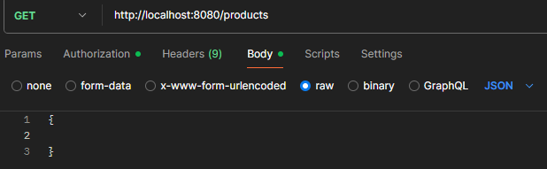

# Project Scope and Example Use Cases

Project covers development of an Spring MVC application that manages product categories and products on a shopping site. 

It fullfills the following use cases:
1. Creating product category
2. Deleting product category
3. Changing the name of existing product category
4. Listing existing category/categories
5. Adding new product to existing product category
6. Deleting existing product from category
7. Updating name and/or price of products
8. Listing existing product/products

All users are allowed to list products and product categories, whereas only users whose role is `ADMIN`
allowed to create, update, and delete product or product categories (`Basic Authentication` used). 
Example usage of API for GET, POST, PUT, and DELETE requests is given in the following seciton. 

In order to run application, execute the following command in terminal from spring boot project's root directory: `.\mvnw spring-boot:run`

NOTE: In order to execute POST, PUT, and DELETE requests `username: admin` and `password: test` must be provided in POSTMAN's authorization tab with Basic Authentication, for GET requests èither of the `username: admin` and `password: test`
or `username: user` and `password: test` username-password pairs can be used.

## Example Scenario for Testing REST API with POSTMAN

First we create **Electronic appliances** product category by making POST request to URL: `http://localhost:8080/productcategories`: 

Creating **Home Appliances** product category by making POST request to URL: `http://localhost:8080/productcategories`

After we create product categories with POST requests, we will create products Playstation 4 and Vacuum Cleaner in Electronic Appliances product category by making POST requests to URL: `http://localhost:8080/products?categoryId=1`

we will also create products Toaster and Oven in Home Appliances product category by making POST request to URL:  `http://localhost:8080/products?categoryId=2` 

we will make GET requests to products and productcategories end points to see whether product categories and products are created with URLs: `http://localhost:8080/products` and  `http://localhost:8080/productcategories`

we will add one more product to Electronic Appliances category which is Xbox Series S with price 20000.5 by making POST request to URL: `http://localhost:8080/products/1?categoryId=1` 

we will now make PUT request to products and productcategories to update Playstation 4 product's price from 15000.5 to 22000.5 and change the Electronic Appliances categorie's name to Electronic Gadgets with URLs: `http://localhost:8080/products/1?categoryId=1` and `http://localhost:8080/productcategories/1`

we will finally make a DELETE request to delete Xbos Series X product and Home Appliances product category with URLs: `http://localhost:8080/products/5` and `http://localhost:8080/productcategories/2` 

## END OF REST API TESTING
